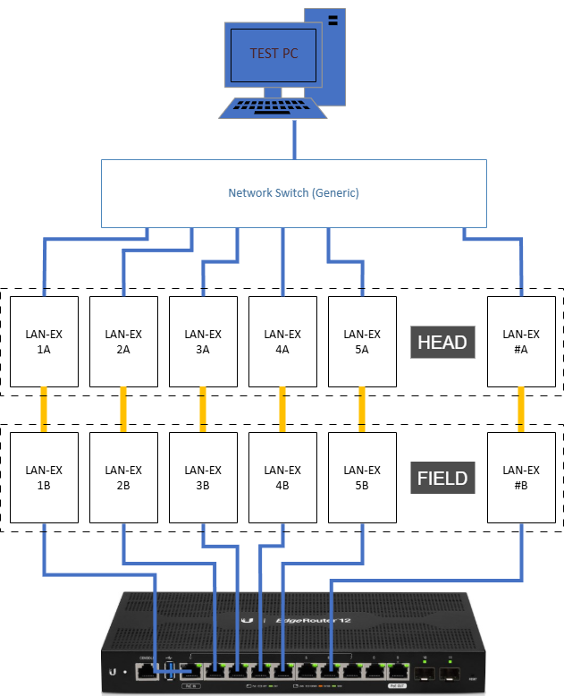

# LAN-EX H/F Tester — Operator Manual

This guide is for the operator running the throughput test. It covers how to start the
tester, enter the setup, read the live screen, and find your results. No technical
background is needed.

---

## 1. What this tool does

The LAN-EX H/F Tester checks that each **Head/Field (H/F) pair** in a set can move data
fast enough and hold a steady connection. It runs continuously — testing every pair over
and over — until you stop it. When you stop, it writes a report showing whether each pair
**PASSED** or **FAILED**, stamped with your initials and the date/time so the result is
accountable.

The test runs in two phases, repeated each cycle:

- **Phase A — Max throughput.** Each pair is tested one at a time, in both directions —
  **F->H** (Field → Head) then **H->F** (Head → Field). Each direction is measured against a
  target speed.
- **Phase B — Soak.** All pairs run together at a low, capped speed for a while. This phase
  only watches for **dropped connections**.

---

## 2. Before you start

Have these ready:

- **Your initials** (2–4 letters) — recorded on the result.
- **The pair serial numbers**, one per pair, in the form `1234567-7654321`
  (7 digits, a dash, 7 digits).
- All pairs **cabled and powered**.


---

## 3. Starting the tester

From the tester PC, open a terminal in the tester folder and run:

```
make run
```

(or `./LAN-EX-Tester` if it is already built).

The setup wizard starts on **Step 1 / 4**.

> **Tip:** At almost any step you can type **`b`** and press **Enter** to go **back** and fix
> the previous answer. The tester checks every entry and will politely re-ask if something
> looks wrong — you can't accidentally continue with a bad value.

---

## 4. Setup steps

You'll be walked through these, one screen at a time. Type the answer, then press **Enter**.

| Step | Screen | What to enter | Rules |
|------|--------|---------------|-------|
| 1/4 | Operator initials | Your initials | 2–4 letters |
| 2/4 | Number of pairs | How many H/F pairs | 1 to 8 |
| 3/4 | Pair serial numbers | Each pair's serial | `NNNNNNN-NNNNNNN` — 7 digits, dash, 7 digits |
| 4/4 | Dip switch check | Confirm the dip settings with `y` | See the on-screen diagram |

**Entering serial numbers:** you enter them one at a time. After the last one, the tester
lists them all and asks you to **confirm**:

- Press **`y`** to accept the list.
- Press **`n`** to re-enter the **last** one. (To fix an earlier one, use `b` to step back.)

The pair-serial screen shows a header like `Pairs in this set: 3` — glance at it to make sure
the pair count is what you expect **before** the test starts.

---

## 5. Pre-test connectivity check

After setup, the tester **pings every pair** to make sure it can reach them.

- If all pairs answer, the test begins automatically.
- If a pair does **not** answer, you'll see:
  *"Pair X could not pass the preliminary test — Please check its connections."*
  Fix the cabling/power for that pair, then **press any key to try again**.

---

## 6. Running the test — the live screen

Once connectivity passes, the live monitor appears and the test runs continuously:

```
  LAN-EX H/F Tester                                         LIVE  press Q to stop & report

  Operator GS   Config 3 pairs   Cycle 4   Elapsed 00:14:32
------------------------------------------------------------------------------------------
  Phase A  max throughput - one pair at a time, 10s each direction
------------------------------------------------------------------------------------------
  Pair Serial            F->H Mbps   H->F Mbps   Drops   Status
  1    1234567-7654321         941         939       0   done
  2    2233445-5544332         938         942       0   done
  3    3344556-6655443         610           -       0   running
  4    4455667-7766554        drop           -       2   FAIL
  5    5566778-8877665           -           -       0   waiting

  Pair 3 F->H [############--------] 62%  6s / 10s
------------------------------------------------------------------------------------------
  Totals  done 2  fail 1      target >= 90 / 190 Mbps
```

**Reading the screen:**

- **Top bar** — `LIVE` means the test is running. The reminder shows **press `Q` to stop**.
- **Info line** — your initials, the configuration, the current **cycle** number, and how long
  the run has been going (**Elapsed**).
- **Phase line** — whether you're in **Phase A** (throughput) or **Phase B** (soak).
- **Pair table** — one row per pair, updating live:
  - **F->H Mbps / H->F Mbps** — the measured speed in each direction (Field→Head, Head→Field).
    Green = met the target, red = below target.
  - **Drops** — how many **cycles** this pair failed to hold a working connection in — whether it
    dropped mid-test or couldn't connect at all — over the whole run. Stays `0` (dim) for a healthy
    pair; turns **red** the moment it fails. Any drop = FAIL.
  - **Status** — what the pair is doing right now (see colors below).
- **Progress bar** — the countdown for the current step (Phase A direction, or the Phase B soak).
- **Totals** — how many pairs have finished (`done`) or failed (`fail`) this cycle, plus the
  target speeds.

**Status colors and words:**

| Shows | Color | Meaning |
|-------|-------|---------|
| `waiting` | dim | not started yet |
| `running` | teal | being tested now |
| `retry 2/3` | amber | a connection couldn't start; the tester is retrying automatically |
| `done` | green | finished this cycle successfully |
| `FAIL` | red | this pair failed (missed its target speed, or its connection dropped) |

The `retry N/M` amber marker means a measurement didn't start and the tester is trying again
on its own — no action needed. If all retries fail, the pair is marked `FAIL` and the run
keeps going.

**Stopping the test:** press **`q`** (or `Q`) at any time. The test finishes what it's doing,
stops cleanly, and moves on to the results.

> Let the test run through **as many cycles as you need** for confidence. The longer it runs,
> the more chances each pair has to reveal an intermittent problem.

---

## 7. Understanding the result

Results are reported **per pair** — there is no single all-or-nothing verdict.

**A pair PASSES only if, in every cycle it ran, it:**

1. met **both** the F->H and H->F target speeds in Phase A, **and**
2. **never dropped** its connection (in Phase A or Phase B).

**A pair FAILS if, in any cycle, it:**

- came in **below target** on F->H or H->F, **or**
- **dropped its connection even once**. A single drop fails the pair.

When the test stops you'll see the **Run Summary**, for example:

```
Started: 2026-07-09 14:22:07
Ended:   2026-07-09 15:07:19
Cycles completed: 118

Pair 1 (1234567-7654321): PASS   peak F->H 941 / H->F 942 Mbps   drops: 0
Pair 2 (2233445-5544332): FAIL   peak F->H 30 / H->F 80 Mbps   drops: 0
Pair 3 (3344556-6655443): FAIL   peak F->H 900 / H->F 910 Mbps   drops: 3

1 / 3 pairs passed
```

`drops:` is the number of cycles the pair had no working connection (it dropped, or couldn't
connect at all). Any value above `0` fails the pair (Pair 2 above failed instead on speed,
with no drops). The **Connection drops** and **Errors** sections below break down which kind.

Press any key to save the reports and exit.

---

## 8. Where the reports go

Reports are saved automatically when you stop. They live in the **`reports/`** folder:

- **Summary report** — `reports/<N>pairs_<pair-serial>_<operator>_<date_time>.txt`
  (e.g. `reports/3pairs_1234567-7654321_GS_20260713_140000.txt` — how many pairs, the unit
  tested, who ran it, and when)
  Contains your initials, the configuration, the **start → end time**, cycles completed, the
  per-pair PASS/FAIL breakdown, the "X / Y pairs passed" rollup, and a list of any
  **connection drops** and **errors** that occurred — so every failure is documented.
- **Engineering report** — `reports/eng/eng_<...>.txt`
  The detailed raw measurement logs, for troubleshooting.
- **`reports/allReports.txt`** — a running log with every run appended.

Each run gets its **own timestamped file**, so a new run never overwrites an old one.

---

## 9. Troubleshooting

| You see… | What it means | What to do |
|----------|---------------|------------|
| "Invalid initials / number / serial" | The entry didn't match the required format | Re-enter as prompted (the message says the expected format) |
| "Pair X could not pass the preliminary test" | That pair didn't answer the ping | Check its cable and power, then press a key to retry |
| A pair stuck on amber `retry N/M` | Its connection couldn't start; the tester is retrying | Wait — it resolves itself, or fails after the last retry |
| A pair goes red `FAIL` with `drop` | The connection dropped during the test | Note the pair; it's recorded in the report. Check cabling/hardware for that pair |
| A pair's F->H or H->F shown in red | The speed was below target | The pair fails on throughput; recorded in the report |
| The screen won't stop | You may not have pressed `q` on the test screen | Press `q` (or `Q`) while the live monitor is showing |

---

## 10. Quick reference — keys

| Key | Where | Does |
|-----|-------|------|
| `Enter` | Setup | Submit your answer |
| `b` | Setup | Go back one step |
| `y` / `n` | Confirmations | Accept / re-do |
| `q` or `Q` | Live test | Stop the test and save reports |
| any key | Result / error screens | Continue |

---

*Target speeds, phase durations, the soak cap, and the retry count are set by your site
administrator in `config/targetBandwidth.conf`. If the targets look wrong for your equipment,
raise it with them rather than changing it yourself.*
